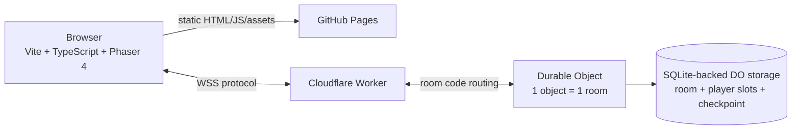

# MineBombers-style Web Multiplayer — Implementation Design Bundle v2

> Goal: an original browser multiplayer mining/demolition game inspired by the **gameplay loop** of classic Mine Bombers, deployed as static client files on GitHub Pages with a serverless authoritative real-time backend.

**Design audit date:** 2026-09-16  
**Primary deployment:** GitHub Pages + Cloudflare Worker + Durable Objects  
**Target:** 2–8 players, desktop-first.

## 1. Architecture



GitHub Pages hosts no authoritative game logic. The Durable Object owns room state, economy and game outcomes.

## 2. Important v2 correction

The first bundle was a useful network/architecture scaffold, but not yet detailed enough to claim that implementation required no further design decisions.

This revision explicitly fixes the missing areas:

- server-owned active-round timing;
- mining/treasure/shop/cash loop rather than generic Bomberman-only gameplay;
- reconnect token/storage rules;
- host grace and room-capacity semantics;
- exact baseline movement/digging/economy/equipment values;
- original graphics asset pipeline;
- placeholder art included in the starter;
- client scene flow;
- file-by-file implementation map;
- corrected lifecycle/cost model for hibernating rooms vs active rounds.

See `docs/12-readiness-audit.md` first.

## 3. Serverless lifecycle

### Lobby / shop / result

Use Cloudflare's Hibernation WebSocket API without a repeating timer so an idle room can sleep while sockets remain attached.

### Playing

A real-time round intentionally runs a server-owned 20 Hz logical simulation timer. This prevents hibernation during the active round, but guarantees that bombs, mines and round deadlines do not depend on clients continuing to transmit movement packets.

```text
Authoritative step:       50 ms / 20 Hz
Snapshot max:             100 ms / 10 Hz
Client render:            60 FPS
Remote interpolation:     ~100–150 ms
Reconnect grace:          20 sec
Checkpoint:               ~2 sec baseline, tune to 3–5 sec after testing
```

## 4. Core v1 gameplay

The primary Classic mode is:

```text
Lobby
 -> Shop
 -> Mine / collect treasure / fight
 -> Round result
 -> Shop
 -> ... 5 rounds
 -> Match result by cash
```

The server owns cash, inventory, digging completion, damage and match result. Exact baseline values live in `docs/14-classic-mode-exact-spec.md`.

## 5. Graphics decision

Do not reuse the original Mine Bombers graphics/audio just because the registered game was later distributed as freeware. Build original assets.

This bundle includes **project-generated development placeholders**:

```text
assets/placeholders/
starter/apps/client/public/assets/gfx/
  tiles_world.png
  miner.png
  bombs.png
  explosions.png
  pickups.png
```

They use a fixed 32x32 contract and can be replaced later with final pixel art without changing gameplay code. See `docs/13-graphics-assets.md` and `assets/spec/asset-manifest.json`.

## 6. Technology stack

| Layer | Choice | Reason |
|---|---|---|
| Language | TypeScript | shared protocol/types |
| Client | Phaser 4 + Vite | top-down 2D + static build |
| Hosting | GitHub Pages | requested static deployment |
| Real-time | Cloudflare Worker + Durable Objects | serverless room authority/WebSocket coordination |
| Persistence | DO SQLite storage | compact room/player/checkpoint state |
| CI | GitHub Actions | static Pages deployment |
| Backend deploy | Wrangler | official Worker deployment tooling |

Package versions were checked on the audit date: Phaser 4.2.1, Vite 8.3.0 and Wrangler 4.132.0. Cloudflare currently recommends generated Worker types via `wrangler types`; use that during implementation rather than depending long-term on a hand-pinned `@cloudflare/workers-types` package.

## 7. Read in this order

1. `docs/12-readiness-audit.md`
2. `docs/01-architecture.md`
3. `docs/14-classic-mode-exact-spec.md`
4. `docs/15-server-timing-cost.md`
5. `docs/16-storage-reconnect-contract.md`
6. `docs/19-map-generator-determinism.md`
7. `docs/03-network-protocol.md`
8. `docs/04-authoritative-simulation.md`
9. `docs/13-graphics-assets.md`
10. `docs/17-ui-scene-flow.md`
11. `docs/18-file-by-file-implementation.md`
12. `docs/06-security-cheat.md`
13. `docs/08-testing.md`
14. `docs/09-cost-capacity.md`
15. `docs/10-implementation-plan.md`
16. `docs/07-deployment.md`
17. `docs/11-production-risks.md`

## 8. What the starter is

`starter/` is still a **scaffold**, not a finished game. That distinction is deliberate.

The design is now intended to be specific enough that the next coding pass can implement the game without changing architecture. The starter provides repository shape, Worker/DO WebSocket skeleton, shared protocol starting point, GitHub Pages workflow and placeholder art.

The remaining TODOs in starter code are implementation tasks described by the documents, not undefined product decisions.

## 9. Official references verified for this revision

- Durable Objects: https://developers.cloudflare.com/durable-objects/
- WebSocket hibernation: https://developers.cloudflare.com/durable-objects/best-practices/websockets/
- Durable Object lifecycle: https://developers.cloudflare.com/durable-objects/concepts/durable-object-lifecycle/
- Durable Object pricing: https://developers.cloudflare.com/durable-objects/platform/pricing/
- Durable Object limits: https://developers.cloudflare.com/durable-objects/platform/limits/
- Phaser textures/spritesheets: https://docs.phaser.io/phaser/concepts/textures
- Phaser tilesets: https://docs.phaser.io/api-documentation/class/tilemaps-tileset
- GitHub Pages limits: https://docs.github.com/en/pages/getting-started-with-github-pages/github-pages-limits

Re-check plan limits and package versions before a public launch.
