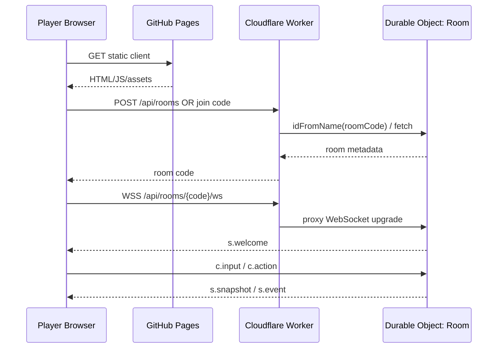

# 01. System Architecture

## Architecture decision

Use a **server-authoritative serverless room** rather than pure peer-to-peer for v1.

### Components



## Client responsibilities

- input collection (keyboard/gamepad; touch later);
- local prediction for the local player;
- interpolation for remote entities;
- rendering, audio and UI;
- packet sequence tracking;
- reconnect attempt and resync request;
- **never decides authoritative damage, inventory, score, item ownership, or match result**.

## Worker responsibilities

The outer Worker is intentionally thin:

- CORS / Origin policy for HTTP;
- generate/validate room codes;
- route `/api/rooms/:code/*` to `GAME_ROOM.idFromName(code)`;
- health/version endpoint;
- no gameplay state.

## Durable Object responsibilities

One Durable Object instance represents one room:

- lobby and player roster;
- WebSocket sessions;
- room host privileges;
- authoritative world state;
- input validation;
- game simulation and collision;
- bomb/mine/projectile resolution;
- snapshots/events;
- reconnect state;
- small periodic checkpoints.

## Why not pure WebRTC in v1

Pure WebRTC reduces backend traffic but adds:

- signaling;
- STUN/TURN requirements;
- asymmetric NAT / enterprise firewall failures;
- host authority and host cheating;
- host migration;
- more complex debugging.

A future hybrid can use WebRTC for high-frequency peer traffic while retaining the Durable Object for room control. It should be considered an optimization, not a prerequisite.

## Data flow

### Create room

1. Client calls `POST /api/rooms`.
2. Worker generates an uppercase room code excluding ambiguous characters.
3. Worker maps room code to a Durable Object ID.
4. DO initializes room metadata if missing.
5. Response returns `{ roomCode, wsUrl, protocolVersion }`.

### Join room

1. Client opens `wss://.../api/rooms/{code}/ws`.
2. DO accepts with the Hibernation WebSocket API.
3. Client sends `c.hello`.
4. DO returns `s.welcome` containing player identity, room snapshot and reconnect token.
5. Client sends `c.ready` from the lobby.

### Start match

Only the lobby host can request start, but the server validates minimum players and all preconditions. Server chooses the map seed and emits `s.start`.

## Room placement

`idFromName(roomCode)` guarantees all connections for the same room code target the same Durable Object identity. Never shard one room across multiple objects in v1.

## Persistence policy

Do not write every tick to SQLite.

Persist only:

- room metadata/config;
- match ID + random seed;
- roster identity/reconnect tokens (hashed where appropriate);
- periodic recoverable world checkpoint, e.g. every 2–5 seconds;
- final match summary if desired.

Transient rendering/network state remains in memory.

## Failure model

- Client disconnect: retain player slot for 20 seconds.
- Host disconnect: host role transfers; game authority does not transfer because the DO is authoritative.
- DO restart/eviction: reconstruct from latest checkpoint + WebSocket attachments where possible, then send full resync.
- Worker deploy during a live game: clients reconnect and ask for full state; deployment strategy should still avoid incompatible protocol rollout.

## Versioning

Always send:

```json
{
  "protocolVersion": 1,
  "clientBuild": "git-sha-or-semver"
}
```

If protocol versions do not match, reject cleanly with an upgrade message. Do not attempt best-effort parsing across incompatible schemas.
